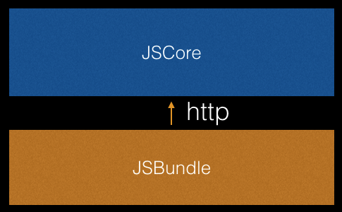
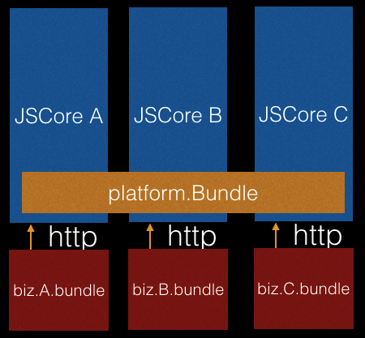
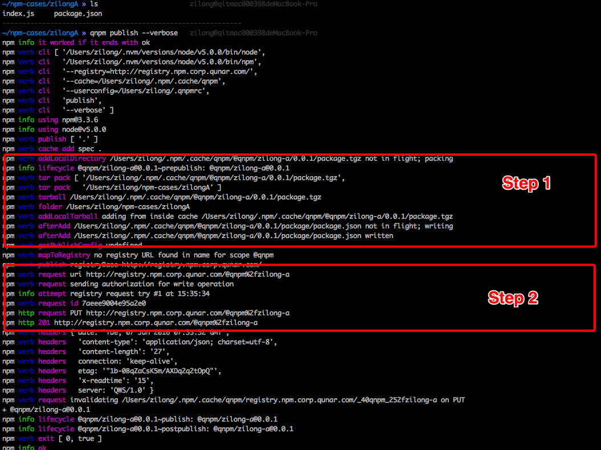
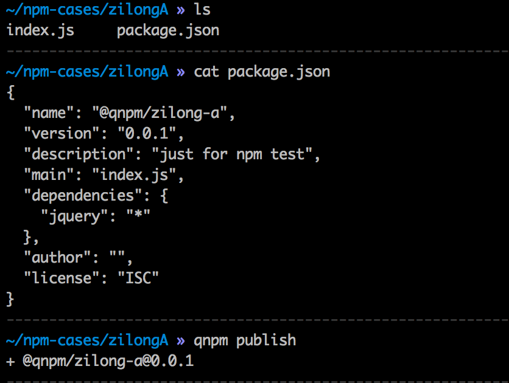
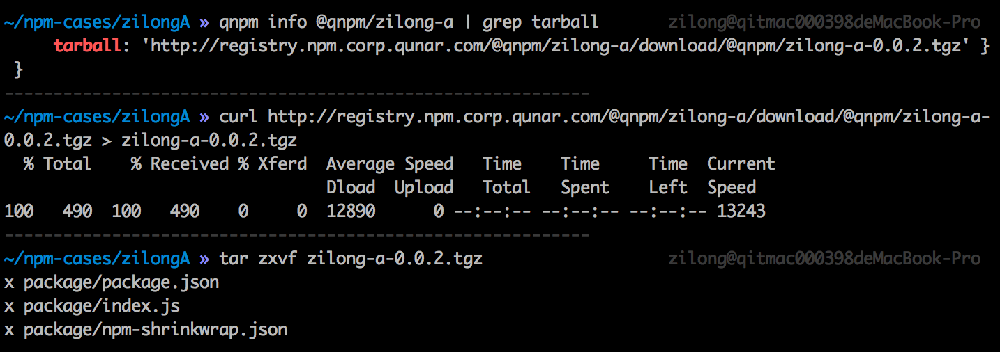

### 现阶段RN的状况
首先一张图极简的说明官方版RN的运行结构，单个的JSCore通过http加载了一个唯一的JSBundle，所有的JS都运行在一个JS上下文。

这明显不适合多团队合作，一个JSCore内代码会互相影响。业务线越多，互相影响就越大。应该是各个业务线拥有自己的JSCore，保持上下文这一级的隔离。
同时一个RN的js bundle体积非常庞大，即使不加入任何业务代码，minify之后仍然有600k左右，那么将RN自身的代码和业务代码拆开打包，也是必须要做的一件事。

所以对业务线众多的公司而言，RN的运行结构应该是这样：将拆分出的RN代码拆包为platform.bundle和biz.bundle；platform.bundle内置在应用里作为公用的基础JS库，每一个JSCore启动时，首先应加载platform.bundle；在platform.bundle加载结束后，再通过网络或者离线包加载biz.bundle。去哪儿已经完成了这一步的改造，大略的结构变为：

在完成上述改造的同时，我们也为业务开发的同事提供一个简单的壳应用，这个壳应用通过本地的http开发服务（react-native-packager)，动态的加载platform.bundle和biz.bundle；在一个新的业务上线的时候，我们只需要在服务器上放入一个小的biz.bundle即可。

但是，在我们在修改官版RN的过程中，遇到两个问题，首先就是React Native包依赖众多（1000多个npm包），无法构成稳定的跨平台开发、打包、测试环境；同时，我们从github上fork过来的react-native@0.20.0版的代码，在npm install的时候，经常被网络错误随机中断在某个模块，但是单个安装中断的模块又没有问题。

我们一起来看一看，这两个问题的产生原因。

### RN包依赖问题的产生的原因

##### 单个项目组应用RN
对于开发者来说，开始一个新的项目，基本上是这样的。首先，拓荒者建立起基本的项目模板并推入代码仓库：

    npm install react-native-cli -g
    react-native init AwesomeProject
    npm shrinkwrap
    git push

然后，其他开发者clone仓库：

    npm install react-native-cli -g
    git clone
    npm install

注意一下npm shrinkwrap，这一步在项目根目录下产生了一个npm-shrinkwrap.json文件，<b>这个文件锁定了整个项目依赖的第三方组件版本</b>。因为npm上众多的源采用Semantic的版本标准，存在大量的这样的情况
> A@0.0.1 -> ^B@0.0.1

如果项目中运用了A@0.0.1的模块，首次install后，依赖树可能是这样的
> project -> A@0.0.1 -> B@0.0.1

如果没有shrinkwrap这一步，当B模块发布了0.0.2版本后，其他开发者重新clone代码仓库并且npm install之后，依赖树就变成
> project -> A@0.0.1 -> B@0.0.2

npm-shrinkwrap.json则可以避免这一问题的产生，因为npm install命令在构建依赖树时，package.json和npm-shrinkwrap.json文件都会产生影响，而npm-shrinkwrap.json的优先级更高。这一步非常重要，它保证了一个项目在开发、测试和上线这样一个相对较长的时间内，每个阶段构建代码的时候产生的内容一致。这是对产品稳定性的重要的保障手段。

##### 众多业务线共同使用RN
我们之前已经提到多个业务线共同使用RN的情况下，拆包是一个必须的过程。在这个场景之下，由于RN的官方包内没有加入shrinkwrap，保证众多开发组的依赖树的一致性就变成了问题。试想一下，在公共技术组发布platform.bundle后，如果有关键组件发布了更新，业务部门在install react-native时一定会产生一个不同的依赖树结构；在依赖树都不稳定的情况下，拆开的platform.bundle和biz.bundle会发生什么问题是无法预测的。

退一步讲，对于不考虑拆包，但是Windows开发者和OS X混搭的开发组来说，仅仅使用npm shrinkwrap锁定依赖树也是不可行的，因为RN依赖了一个OS X专有的模块fsevents。Mac系统shrinkwrap、签入代码后，Windows系统根本就无法运行npm install，fsevents挡住了windows的安装。

讨论解决方案之前，我们先挖一挖npm publish和npm install命令，看看npm-shrinkwrap.json怎么影响install过程。

<!-- npm2，npm3策略不同 -->

### 挖一挖npm publish和npm install命令
在后续的讨论内，很多地方使用了qnpm命令，qnpm是qunar内网的一个和npm同步的源，qunar内部也有很多私有模块在qnpm源上。后续讨论中需要发布一些测试用的模块。因为left-pad事件后，npm公源修改了unpublish的规定，为了少制造垃圾，测试放在私有源上。

##### npm publish过程解析
众所周知，npm publish是将模块发布到npm源的命令。publish过程是什么？我们找个模块来看看日志，做一个感性的认知。

我认为可以将publish分为两步：
1. 将代码打成tgz包，并放在npm的cache目录下。在这一步，.npm-ignore文件和package.json内的files字段配置都可以配置tgz所包含的内容。在不做任何配置的情况下，npm-shrinkwrap.json会被压进tgz包，这一点将在后面验证。
2. 上传tgz并更新npm源。

#### npm install过程解析
开始这一节之前，我们先约定一个不甚确切的名字“简洁模块”。一个模块在分发后，不依赖于其他任何模块，就称为“简洁”模块，例如jQuery@2.\*；否则，称为“非简洁”模块，例如react-native。注意这不是通用的叫法，只适用于本次的谈论。在写下这篇讨论时，jquery最新版为2.2.4。

###### npm install一个“简洁”模块
我们调高npm的日志等级，使用npm install jQuery --save --verbose，简单看看npm install命令会发生什么事情。

可以看到，对“简洁模块”的install过程，主要分为3步
1. http get了一个地址[https://registry/jquery](https://registry/jquery)。可以在Chrome内打开链接自行尝试，这个http的链接内是jquery这个模块的基本信息，包含了版本历史、依赖、作者和各个版本的tgz下载链接等等。由于我们没有指定安装版本，这个http返回的信息内的下载链接是jquery@2.2.4版的。
2. 下载第一步的结果得知的tgz链接，并解析tgz的依赖。
3. 解压缩jquery.tgz包到node_modules并完成安装过程。

第二步复杂一点，稍作解释：
addRemoteTarball这个操作，执行了tgz的下载操作，并且将下载文件放置入了npm的cache目录内；addTmpTarball这一步操作，会读取jquery@2.2.4的依赖（从缓存，缓存中没有则立即解压tgz并读取package.json），决定是否需要继续安装其他模块。

那么npm install一个“非简洁”模块会怎样？

###### npm install一个“非简洁”模块
先做一个准备。在去哪儿的npm私有源上发布一个“非简洁模块”。

我们观察一下“非简洁模块”的tgz包内包含什么：

这个模块虽然“非简洁”，但是依然非常简单。我们检查tgz文件内容，里面没有什么神奇的东西，只有一个package.json和我们的JS代码而已。

我们准备开始install“非简洁模块”。为了更好的认知这个过程，在这次install需要把日志等级继续调高，npm install @qnpm/zilong-a@0.0.1 --loglevel=silly。silly这一级的日志已经爆长，阅读起来非常困难，不再贴图，我归纳一下过程：

<!--  -->
1. 从[https://registry/zilongA](https://registry/zilongA)上获取安装包的信息，包含了版本历史、依赖、作者和各个版本的tgz下载链接等等。
2. 下载第一步的结果得知的tgz链接，解压缩zilong-a.tgz包，读取package.json的dependencies，发现其中的有jquery依赖。
3. 重复步骤1和2，并下载jquery.tgz。
4. 解压各个tgz包到node_modules。

简言之，npm install是一个不停的发现依赖模块、下载文件、解析依赖，直到没有更多模块需要下载，随后一起解压到node_modules目录的过程。

###### 给“非简洁”模块加入npm-shrinkwrap.json
我们给简单的给zilong-a模块升级一下，先将package.json内的version修改为0.0.2，然后将一个较低版本的jquery放入zilong-a的依赖树：

    qnpm install jquery@2.2.0 --save
    qnpm shrinkwrap
    qnpm publish

重新检验一下服源上的tgz的内容，发现npm-shrinkwrap.json已经被压入了压缩包，证实了之前的推断。

npm install @qnpm/zilong-a@0.0.2 --loglevel=silly。检查对比安装0.0.1版本的日志，发现install过程产生了变化，截取中间重要变化来说明问题，看截图：

我们发现，在解析完zilong-a@0.0.2的依赖时，加入了addShrinkwrap的步骤，这一步读取了npm-shrinkwrap.json内容；然后直接进入了jquery@2.2.0的下载和解析步骤，没有从npm上获取jquery的基本信息，jquery的安装过程被提前了。这一次尝试后，我们初步厘清了npm-shrinkwrap.json对安装过程的影响。

梳理zilong-a@0.0.2一下目前的依赖结构，目前只有两级：
>  @qnpm/zilong-a@0.0.2 > jquery@2.2.0

整个下载过程也是
> @qnpm/zilong-a@0.0.2 > jquery@2.2.0

###### 继续将“非简洁”模块复杂化
我们继续发布@qnpm/zilong-a@0.0.3，使其依赖树加深。首先发布一个@qnpm/zilong-b@0.0.1模块，@qnpm/zilong-b依赖jquery@\*;去掉@qnpm/zilong-a的jquery依赖，加入@qnpm/zilong-b@\*。那么依赖结构变化为：
>  @qnpm/zilong-a@0.0.3 > @qnpm/zilong-b@0.0.1 > jquery@*

修改package.json后，重置zilong-a模块重新npm shrinkwrap，并发布

    rm -rf node_modules && rm -rf npm-shrinkwrap.json && qnpm install
    qnpm shrinkwrap
    qnpm publish

zilong-a@0.0.3模块依赖被锁定为 @qnpm/zilong-b@0.0.1和最新的jquery@2.2.4。那么install @qnpm/zilong-a@0.0.3会怎样？

这一次又产生了有趣的变化，虽然@qnpm/zilong-a的package.json内并没有声明对jquery的依赖，由于npm-shrinkwrap.json包含了jquery和@qnpm/zilong-b的信息，jquery的安装过程和@qnpm/zilong-b同时开始了。

可见shrinkwrap不仅仅影响了npm install时的版本判断，而且改变了下载流程，使得下载过程变成了并行的。

然而，官方在npm的github的讨论中说：对于下载请求，没有任何的队列或者限制机制，有多少下载的包，就并发多少。在npm的github有一些讨论是关于这个机制的，起因都是因为开发者使用了第三方源，而源服务器限制了下载请求而导致安装失败。有兴趣的同学可以在分享后参看[issue11117](https://github.com/npm/npm/issues/11117)和 [issue11125](https://github.com/npm/npm/issues/11125)。

我们似乎找到了tgz文件损坏的原因：对于超级大库而言，庞大的并发请求数量造成巨量的并发请求；在采用不经优化的网络（比如GFW墙内访问墙外），文件坏掉的可能性增加。shrinkwrap加剧了这个问题。

搞清楚原因，tgz损坏的故障就是小case，我们fork过来的react-native源代码内的npm-shrinkwrap的模块地址全部指向了npm公有源，简单的做一下替换，全部切换到qunar的私有源上或者cnpm源上，基本就解决了安装失败的问题。

### 探讨可能的方案
网络问题很easy的解决了，但是包依赖的问题还在。在考虑解决方式前，我们先看一下react-native官方对于shrinkwrap的态度，理一理可能的方向。

###### react-native官方对于shrinkwrap的态度
查阅github提交记录可以发现，直到0.22.0-rc2之前，rn项目的根目录下都有npm-shrinkwrap.json文件；有意思的是，从npm源直接下载的tgz的文件内不包含这个文件。也就是说，facebook的开发们一度使用shrinkwrap统一了所有RN contributor的依赖树，但是并不打算统一其他RN使用者的依赖树。官版对于锁定版本的态度是模糊的。在社区的要求下，facebook将npm-shrinkwrap.json加入了0.22.0-rc2，然后社区内的尝鲜者们反映了安装失败的问题。大约一个钟头后，官方不仅从发布的脚本内删除了npm shrinkwrap命令，并且坚决的从github的目录内删除了npm-shrinkwrap.json文件。fb的一位开发者事后在自己的facebook上回顾这个事件并如是说：
> ... This（注：就是npm-shrinkwrap.json文件） was added in one of the -rc releases, so finding it was fairly easy. I can't be 100% certain what was the reason, npm client is a big box of wonders.

直到今天官版也没有再将这个文件加回来，可见友谊的小船已翻了个底儿朝天。

<!-- ###### npm对于shrinkwrap的态度
npm大约在3.7.x前后（2016年年初）修复了一版shrinkwrap的平台依赖问题，他们的策略是“对于npm-shrinkwrap.json内的平台不兼容的模块，打出一个[warning]或者[info]及的log，然后继续安装。”这个方式感觉不是那么完美，但是对于大部分模块来说，似乎已经足够了（仍然有少量ubuntu用户在3.8.x报错）。

综合来看，即使npm官方在3.7.x版本修复了shrinkwrap，考虑到众多低版本npm的使用者，react-native短期内也不可能再加入shrinkwrap。 -->

只有自己动手了。我们缺的，只是一个能够区分os的npm-shrinkwrap.json。

###### 设想
明白了shrinkwrap和install的过程，那么我猜想这样的方式应该可行：
1. 我们需要提供针对不同操作系统的react-native压缩包，内里分别包含不同系统的npm-shrinkwrap.json，例如对于0.20.0，分别提供react-native-0.20.0-shrinked-darwin.tgz、react-native-0.20.0-shrinked-win32.tgz、react-native-0.20.0-shrinked-linux.tgz。为了避免依赖树的变形，这个三个系统的压缩包是在同一时刻生成的。
2. 可能需要一个内网的http服务或者共享的文件托管服务，提供压缩包的下载。
3. 需要有服务或者命令，能够方便的生成这三份不同的压缩包。
4. 对于业务的开发者或者发布机，我们需要一个命令，能够根据操作系统选择性的下载修改后的rn的压缩包进行安装。

http服务不是问题，方案很多。那么现在需要问的就是：
1. 怎样为Windows，OSX和Linux打出一个可以安装的rn压缩包？
2. 什么样的命令可以帮助使用者安装正确版本的RN？

我们试试手打一个react-native-0.20.0-shrinked-darwin.tgz，并且用这个包来初始化一个项目。

###### 试一试手打的tgz，并init AwesomeProject
开始之前，简单介绍一下react-native init命令，react-native init AwesomeProject实际执行了三个步骤：
1. 建立AwesomeProject文件夹，并放入一个简单的package.json
2. 在AwesomeProject内，运行npm install react-native --save
3. 将模板拷贝到AwesomeProject文件夹内。

ok，我们开始为Mac系统创造一个手打的包。以qunar正在使用0.20.0版本为例：

    curl http://registry.npm.taobao.org/react-native/download/react-native-0.20.0.tgz > react-native-0.20.0.tgz
    tar zxvf react-native-0.20.0.tgz && cd package
    npm install && npm shrinkwrap && rm -rf node_modules

这三个命令就是从淘宝源下载tgz、解压tgz、install和shrinkwrap，最后移除node_modules。

我们对文件做一个小小的修改，以验证我们自己的tgz也可以生效。我们将npm-shrinkwrap.json内的diff@2.2.3修改为diff@2.2.2，并且重新压缩。

     cd .. && tar zcvf react-native-0.20.0-shrinked-darwin.tgz package

命令结束后，在目录下已经有了一个react-native-0.20.0-shrinked-darwin.tgz。至此，我们已经获得了一个为Mac系统定制的rn压缩包。我们来尝试用这个文件来创建一个名叫AwesomeProject的rn项目。下一步需要将react-native-0.20.0-shrinked-darwin.tgz安装进来。

    mkdir AwesomeProject && cd AwesomeProject
    echo "{\
        \"name\":\"AwesomeProject\",\
        \"version\":\"0.0.1\",\
        \"private\":true,\
        \"dependencies\": {\
            \"react-native\": \"file:../react-native-0.20.0-shrinked-darwin.tgz\"\
        },\
        \"scripts\":{\
            \"start\":\"node node_modules/react-native/local-cli/cli.js start\"\
        }\
    }" > package.json
    qnpm install

我们这里手动建立了AwesomeProject目录，并且往目录内写入了package.json，注意里面的react-native的依赖，指向了react-native-0.20.0-shrinked-darwin.tgz文件。install结束后，检查diff组件的版本，果然安装的就是2.2.2版。
<!-- 我们知道npm3是会拍平模块的，然而检查node_modules发现所有的模块都被安装到了react-native模块下。没关系，dedupe一下，把树拍平。
 -->

至此，我们模拟了react-native-cli的构建项目的前两步，验证了手打的tgz一样可以安装，而且手打入的npm-shrinkwrap.json一样可以影响安装的依赖树结构。下一步就是模板拷贝了。

我们直接扒官版的react-native-cli的代码，运行已安装好的react-native里的cli.js。

    node
    var path = require('path');
    var root = process.cwd();
    var cliPath = path.resolve(root, 'node_modules', 'react-native', 'cli.js');
    var cli = require(cliPath);
    cli.init(root, 'AwesomeProject');

运行结束后，键入react-native run-ios来测试。

一颗赛艇！短暂的编译之后，模拟器和react-native-packager都启动起来了，我们看到了熟悉的AwesomeProject的界面。至此，技术上的可行度至此已经证实了。

### 方案
那么我们总结一下针对RN锁定依赖树的方案：
1. 内网搭建一个简单的http下载服务或者文件托管服务，提供三个平台的tgz下载
2. 给手打tgz包的命令稍做增强，使其能生成三个tgz并分发给http或者文件托管系统。这里需要一个Mac、一个Linux和一个Windows的机器分别来做这个事情。
3. 建立一个简单的Node脚本，辅助RN的init工作（复刻上面init的过程）；考虑到package.json是多平台公用，在新的init脚本后，需要将dependencies内的rn依赖从文件系统的地址改回正确的rn版本号（上面的例子应该改回0.20.0）。
4. 考虑到其他开发者是从代码仓库clone过来的package.json，他们不会重复的使用新的init脚本；那么需要一个reset-module脚本，这个脚本只需要完成两件事：
  - 删除node_modules(如果有的话)，然后根据操作系统的版本和dependencies内的RN版本获取tgz的链接，然后npm install。
  - 依次调用npm install，安装除了RN以外业务代码依赖的模块。

### 总结
记得有个同事讲过一个笑话，包依赖管理器只有两种，一种是被骂的狗血淋头的，一种是没人用的。在多业务线共同开发ReactNative这个场景下，shrinkwrap不能很好的解决操作系统的差别，这个锅当然要发给npm；但是反过来，对于框架开发者来说，使用optionalDependencies或者使用带有操作系统差异的模块时，不妨先掂量掂量其中的问题，事实上，对于RN来说，去掉fsevents后代码依然可以运行，只是在开发时编译代码的速度会慢一点。

已经有很多关于“造轮子 vs 使用第三方组件”的争论，这是问题可能没有终点。但是在使用第三方组件时，不妨带着审视的态度，每引入一个依赖，都意味依赖管理的成本上升。当依赖复杂到一定程度后，可能会产生难以理解的问题。
